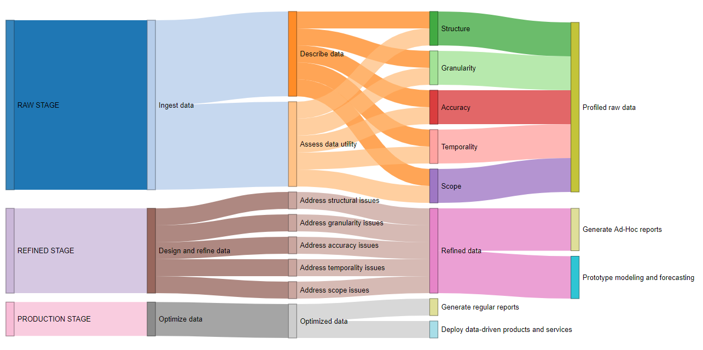
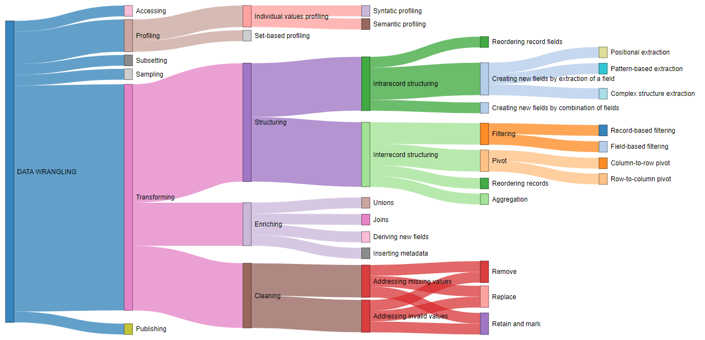

# Simple diagrams for the newbie in data wrangling (like myself)

I have being studying data science for some time now, and in more than one occasion I have read about the importance of properly wrangling the data before analyzing it. In fact, **it is common to read that most of the data scientist time is spent preparing data**, and only a minor part of it is dedicated to analyze the data.

To learn more about this, I have read the book **Principles of Data Wrangling - Practical Techniques for Data Preparation** by Rattenbury and colleagues, and published by O'Reilly. For a newbie like me, the book is very informative, and I recommend it as an introduction to the theme for any newcomer (you can buy the book on Amazon, or download a free copy from the [Trifacta website](https://www.trifacta.com/gated-form/principles-of-data-wrangling/)).

The book present some useful figures and sketchs, but while I was reading it, I tried to synthetize the main ideas in my own diagrams.

I have created this repository to share the diagrams I have come up with, and the code I have used to generate them. The idea was representing the main activities involved in data wrangling as a **network of nodes**, connected accordingly to their **hierarchy**. I have created two diagrams:

* *Data workflow*: displays the different stages and activities in a data project. In several of the stages, **data wrangling** is a major component.  
* *Data wrangling*: displays the different aspects of manipulating data to prepare it for analysis.

Interactive diagrams were created using the `networkD3` library in `R`. As always, any comments are greatly appreciated.

> **Note on the diagrams**: I have chosen **Sankey diagrams** to represent the different activities involved in data wrangling. The reason to do so was mainly cosmetic: I though it was the best format to display the multitude of nodes in the networks, while making the overall structure clear. But it is important to note that Sankey Diagrams are mostly used to represent network flows and their proportions. In my diagrams, flow proportions were arbitrarily defined. These diagrams are not intended to be a **formal representation** of the relationships between data wrangling activities. For instance, all cyclic relationships are missing (you can read about them on the book). And, of course, the list of activities is not exhausted and some tasks may be missing.

## Data workflow diagram

The first diagram represents the network of usual activities in the workflow of data projects. There are three main stages:

* Raw stage
* Refined stage
* Production stage

The cool thing about using `networkD3` is that **it creates interactive diagrams**. Unfortunately, GitHub `README.md` files don't support complex HTML. This is why I'm presenting a static image here.

> But you can find the interactive version of the diagram [here](http://rpubs.com/paulo_haddad/ds_data_wrangling)!

Note that in the interactive version, when the user hover the mouse over each node, **the definition of that activity is displayed**.

If for some reason you can't check out the interactive version of the diagram, check the [Tables section](https://github.com/pmhaddad/ds_data_wrangling#tables) of this `README.md`. In there, you will find a table with all the nodes that appear on the diagram, as well as their basic definition and a few comments.

If you are curious, the code used to create this diagram is right [here](scripts/data_workflow_framework.R), in this very repo.

## Data wrangling diagram

The second diagram represents the network of core tasks when wrangling data. There are four main tasks:

* Accessing data
* Profiling data
* Transforming data
* Publishing data

When the dataset is too big to wrangle as a whole, two additional wrangling tasks may be added:

* Subsetting data
* Sampling data

Again, `networkD3` was used to create an interactive diagram, not the static image shown above.

> The interactive version of the diagram is [here](http://rpubs.com/paulo_haddad/ds_data_wrangling_2)!

As in the previous diagram, when the user hover the mouse over each node, **the definition of that task is displayed**. The same information is displayed in the [tables section below](https://github.com/pmhaddad/ds_data_wrangling#tables).

Finally, the code used to create this diagram can be found [here](scripts/data_wrangling.R).

## Wrap Up

This was a simple project I enjoyed developing while studing data wrangling. I hope someone also find it useful. Feel free to get in touch to make suggestions! Cheers!

## Tables

Below you find the tables listing all nodes on the diagrams, as well as their definition and some comments.

#### Data workflow diagram

Node | Type | Definition | Comment
---- | ---- | ---------- | -------
Raw | Stage | Stage with the goal to produce profiled raw data, i.e., data with known characteristics ready to be refined. | 
Refined | Stage | Stage with the goal to produce refined data, i.e., data that can be used to derive indirect value from data. | 
Production | Stage | Stage with the goal to produce optimized data, i.e., data that can be used to derive direct value through automated systems. | 
Ingest data | Primary action | Act of importing raw data into the analysis environment. | Ingestion involves minimal data transformation-just enough to comply with the syntactic constraints of the data storage system.
Design and refine data | Primary action | Act of modifing profiled raw data to produce refined data. | Designing and preparing "refined" data often involves a significant amount of transformation. The goal is to create canonical data for widespread consumption. It should support as many analyses as possible, although it is usually necessary to iterate this processes several times for specific analysis.
Optimize data | Primary action | Act of modifing refined data to produce optimized data. | The goal is to create optimized data to feed automated systems.
Profiled raw data | Output | Data in raw form, but with its main characteristics described and its utility assessed, ready for further processing. | 
Refined data | Output | Data in canonical form for further widespread consumption (i.e., a form that enables a wide range of analyses). | Comparing to the raw data, refined data has been further wrangled to align with foreseeable analyses. As such, it should support as many analyses as possible, although it is usually necessary to iterate this processes several times as new or more specific analysis are required.
Optimized data | Output | Data in optimal form for further, well-defined recurrent analyses. | It can also be called production-quality data.
Describe data | Output action | Act of examining and recording data characteristics. | The book calls this "generate generic metada"
Assess data utility | Output action | Act of using data characteristics to determine its value. | The book calls this "generate custom metadata"
Generate Ad-Hoc reports | Output action | Act of performing retrospective analyses that address specific questions. | Ad-Hoc reports usually answer specific questions. These reports are primarily retrospective-they use historical data to answer questions about the past or present. Results will provide indirect value by informing and influencing people.
Prototype modeling and forecasting | Output action | Act of performing prospective analyses that try to understand the relevant factors that drive the analyzed phenomenon. | Prototype models and forecasts are primarily prospective-they use historical data to answer questions about the future. Results will provide indirect value by informing and influencing people.
Generate regular reports | Output action | Act of performing recurrent and automated retrospective analyses that address specific questions. | The results will provide indirect value by informing and influencing people.
Deploy data-driven products and services | Output action | Act of performing recurrent and automated prospective analyses that try to understand the relevant factors that drive the analyzed phenomenon. | The results will provide direct value by feeding automated systems.
Structure | Key aspect | The structure of a dataset refers to the format and encoding of its records and fields. | 
Granularity | Key aspect | The granularity of a dataset refers to the kinds of entities that each data record represents or contains information about. | 
Accuracy | Key aspect | The accuracy of a dataset refers to its quality. | 
Temporality | Key aspect | The temporality of a dataset refers to the limitations that may exist due to the fact that a data record is a representation of an entity at a particular time. | 
Scope | Key aspect | The scope of a dataset refers to the coverage on its two dimensions: 1) the number of distinct fields represented; 2) the number of distinct field-by-field values represented (population coverage) | One way to examine population coverage is to contemplate the question: are "all" the possible attributes for each field represented?
Address structural issues | Key aspect | Manipulate the dataset in order to solve structural issues previously identified. | 
Address granularity issues | Key aspect | Manipulate the dataset in order to solve granularity issues previously identified. | 
Address accuracy issues | Key aspect | Manipulate the dataset in order to solve accuracy issues previously identified. | 
Address temporality issues | Key aspect | Manipulate the dataset in order to solve temporality issues previously identified. | 
Address scope issues | Key aspect | Manipulate the dataset in order to solve scope issues previously identified. | 

#### Data wrangling diagram

Node | Type | Definition | Comment
---- | ---- | ---------- | -------
Data Wrangling | Process | The range of tasks involved in preparing your data for analysis. | The bulk of data wrangling involves frequent iterations between transforming and profiling. Although this is - by far - the main iteration cycle, it is not the only one - see Fig. 3.1.
Accessing | Task | Task of reading and loading data into the wrangling environment. | Accessing includes activities such as: manipulate datasets location, e.g., moving datasets to appropriate directories; Replicate datasets to ease access; Compare datasets to select the most appropriate ones.
Profiling | Task | Task of examining data to make sure each transformation is performed as expected. | Profiling is performed with the aid of lists of values, tables of summary statistics, visualizations.
Subsetting | Task | Task of splitting heterogeneous data into homogeneous subsets to be wrangled separetely. | Subsetting is an additional task: it is necessary only in particular circunstances.
Sampling | Task | Task of sampling massive datasets into representative samples to be wrangled in feasible time frames. | Sampling is an additional task: it is necessary only in particular circunstances.
Transforming | Task | Task of manipulating structure, granularity, accuracy, temporality, and scope of data | 
Publishing | Task | Task of publishing data wrangling results for downstream consuption. | The outputs can include: transformed version of the input datasets (raw, refined, optimized); Transformation logic itself; Profiling metadata for monitoring automated services; Reports (visualizations, summary statistics, ...), products, services.
Individual values profiling | Core type | Act of determining the validity of individual record fields. | 
Set-based profiling | Core type | Act of determining the distribution of values for: 1) a given field across multiple records; 2) multiple fields across multiple records. | 
Structuring  | Core type | Act of changing the form or schema of the data. | 
Enriching | Core type | Act of adding fundamentally new values to the dataset. | Enriching transformations create new fields or records using new data - information that was not previously present in the dataset. This information can be a related dataset, or formulas use to calculate fields.
Cleaning | Core type | Act of fixing irregularities in the dataset. | 
Syntatic profiling | Subtype | Profiling for syntactic constraints involves simply checking whether data values are in (or not in) the set of permissible values. | Syntax refers to constraints on the literal values that are valid in a field (i.e., formatting or data types).
Semantic profiling | Subtype | Profiling for semantic constraints involves checking whether data value meanings are in (or not in) the set of meaningful values. | Semantic type constraints correspond to the meaning or interpretation of field values (i.e., context): values are valid if their interpretations satisfy the constraints.
Intrarecord structuring | Subtype | Act of manipulating individual records or fields. | 
Interrecord structuring | Subtype | Act of manipulating multiple records and fields at once. | 
Unions | Subtype | Act of appending the number of records in a dataset by combining it with another compatible dataset. | 
Joins | Subtype | Act of appending the number of fields and records in a dataset by combining it with a related dataset. | 
Deriving new fields | Subtype | Act of creating a fundamentally new field on the dataset. | An example is to use a formula to calculate a new field. It is similar to structuring activities that create fields, but it brings something exterior to the dataset (in this case, the formula).
Inserting metadata | Subtype | Act of adding metadata into the dataset. | Common metadata to add include the filenames of the source data, byte offsets and/or record numbers, current date and/or time, creation/update/access timestamps, and record and/or record field lineage.
Addressing missing values | Subtype | Act of solving issues related to missing records. | 
Addressing invalid values | Subtype | Act of solving issues related to invalid records. | Records may be deemed invalid because their values are syntatically or semantically incorrect.
Reordering record fields | Operation | Act of changing the order of fields in the dataset. | Useful operation to diplay related fields close together.
Creating new fields by extraction of a field | Operation | Act of creating a new field on the dataset by extracting data already present in another field. | 
Creating new fields by combination of fields | Operation | Act of creating a new field on the dataset by combining data already present in other fields. | 
Filtering | Operation | Act of removing records or fields of the dataset based on a defined creteria. | 
Aggregation | Operation | Act of combining multiple records of the dataset into a summary value by applying a defined operation. | Aggregations are paramount to change data granularity. In aggregations, each input record maps to one and only one output record, whereas each output record combines one or more input records.
Pivot | Operation | Act of shifting records into fields and vice versa. | 
Reordering records | Operation | Act of changing the order of records in the dataset. | 
Remove | Operation | Act of removing an innacurate record from a dataset. | 
Replace | Operation | Act of replacing an innacurate record from a dataset for a value deemed appropriate. | Also known as "imputation".
Retain and mark | Operation | Act of keeping an innacurate record on a dataset, but flaging it as innacurate. | 
Positional extraction | Technique | Technique used to extract substrings of a field by specifying the starting and ending positions that correspond to the desired substring. | The starting and ending positions may be fixed, or may be variable, but defined by specific characters.
Pattern-based extraction | Technique | Technique used to extract substrings of a field by specifying the rules that describe the sequence of characters of the desired substring. | Regular Expressions are a very common way to perform this.
Complex structure extraction | Technique | Technique used to extract individual elements from semi-structured datasets, such as XML and JSON. | This type of extraction is particularly common when wrangling JSON files or other semistructured formats.
Record-based filtering | Technique | Technique used to remove records based on their values. | 
Field-based filtering | Technique | Technique used to remove fields. | 
Column-to-row pivot | Technique | Technique used to shift multiple fields of a single record into a single field with multiple records. | In column-to-row pivots, each input record maps to multiple output records, and each output record maps to one and only one input record. This type of column-to-row pivot is commonly referred to as "unpivoting", "denormalizing" or "tidying" data.
Row-to-column pivot | Technique | Technique used to shift a single field with multiple records into multiple fields of a single record. | In row-to-column pivots, each output record is sourced from multiple input records and input records might support multiple output records.
